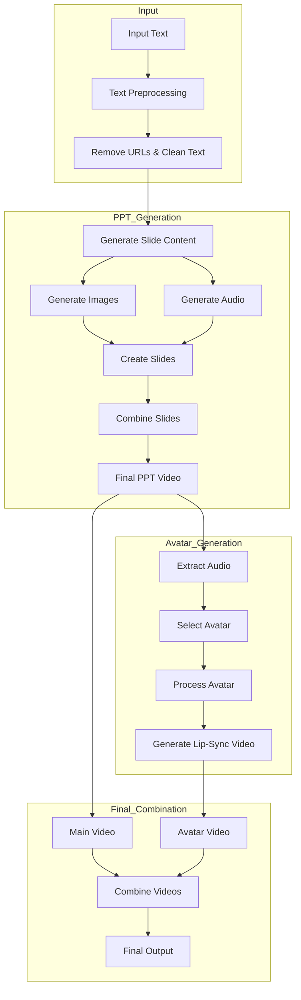
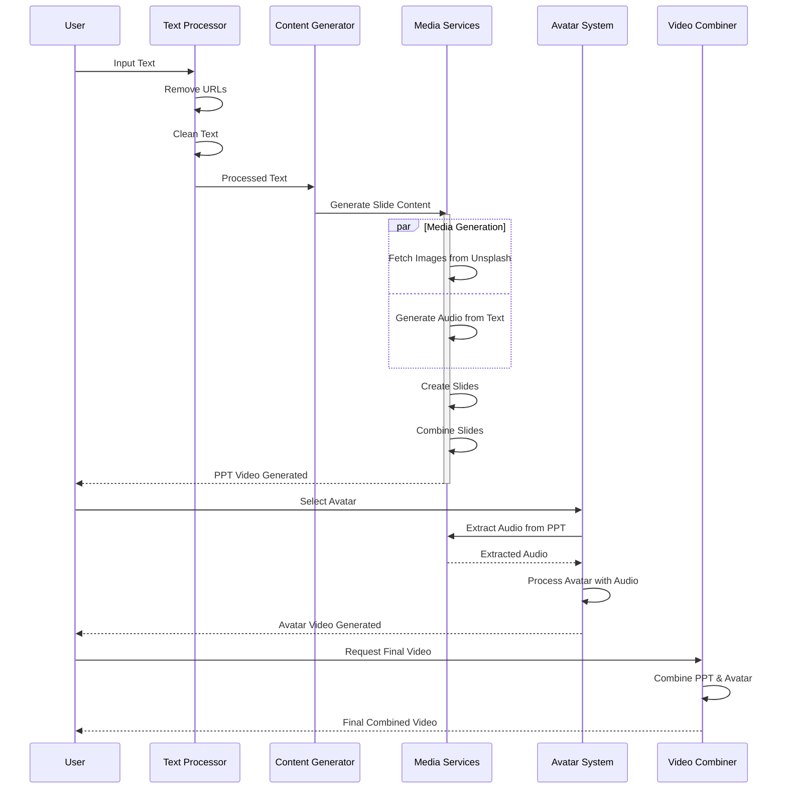

# Text to AI Presenter Video 🎥

An automated system that converts text into educational videos featuring AI presenters. The system generates professional presentations with synchronized avatar animations, creating engaging educational content.

## 🎯 Features

- Text preprocessing and URL cleaning
- Automatic slide generation with Gemini Pro AI
- Dynamic image fetching from Unsplash
- Text-to-speech conversion with natural voices
- Avatar lip-sync animation
- Automatic video composition and rendering

## 🔄 Process Flow

## 🔍 Detailed Process Flow

## 🚀 Quick Start

1. Open the project in Google Colab using the badge above
2. Run all cells in the installation section
3. Enter your presentation text
4. Select your preferred voice
5. Choose an avatar
6. Wait for the final video generation

## 📋 Requirements

- Python 3.8
- CUDA-enabled GPU (for avatar generation)
- Required Python packages:
  - edge-tts
  - moviepy
  - google-generativeai
  - pillow
  - python-pptx
  - torch
  - and others as listed in requirements.txt

## 🎥 Demo Video

  

## 🔧 Technical Components

1. **Text Processing**
   - URL removal
   - Text cleaning
   - Content structuring

2. **Presentation Generation**
   - Slide content generation using Gemini Pro
   - Image fetching from Unsplash
   - Audio generation using Edge TTS

3. **Avatar System**
   - Audio extraction
   - Lip-sync processing
   - Video rendering

4. **Video Composition**
   - Video synchronization
   - Final rendering
   - Quality optimization

## 🎨 Available Voices

- en-US-AvaNeural (Female)
- en-US-ChristopherNeural (Male)
- en-US-EricNeural (Male)
- en-US-JennyNeural (Female)

## 🤖 Available Avatars

- anne
- Narendra Modi
- Sky_2
- Rayan
- Rohit
- Diva
- Elon Musk
- Ava
- Mathew
- HC Verma
- Alicia

## 🙏 Acknowledgments

- Google Generative AI for content generation
- Unsplash for image resources
- Edge TTS for voice synthesis
- SadTalker for avatar animation

## 💡 Contributing

Contributions are welcome! Please feel free to submit a Pull Request.

## 📧 Contact

Aakashdeep Srivastava
---

Made with ❤️ for educational content creation
